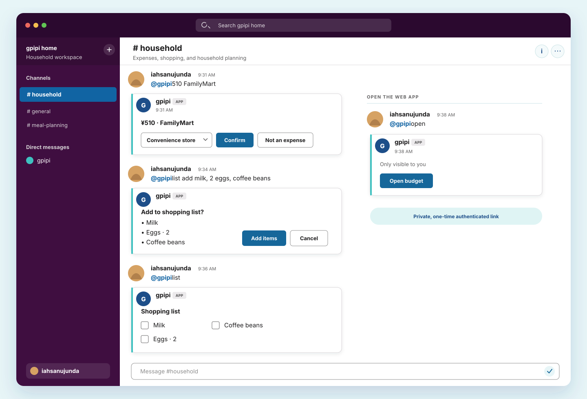
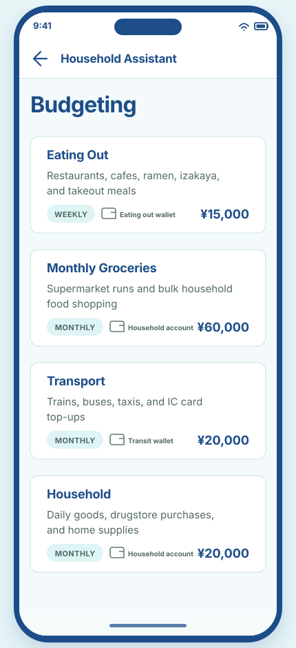
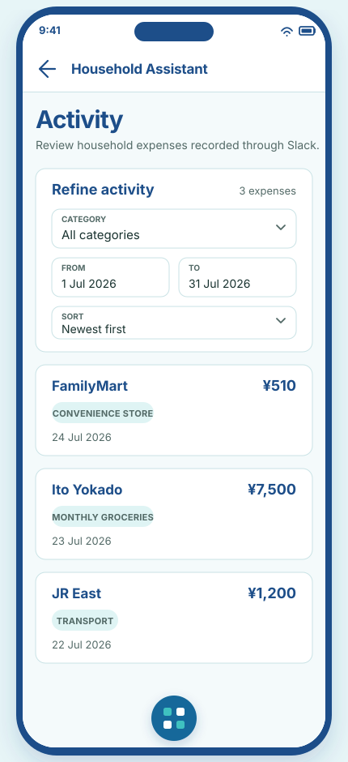
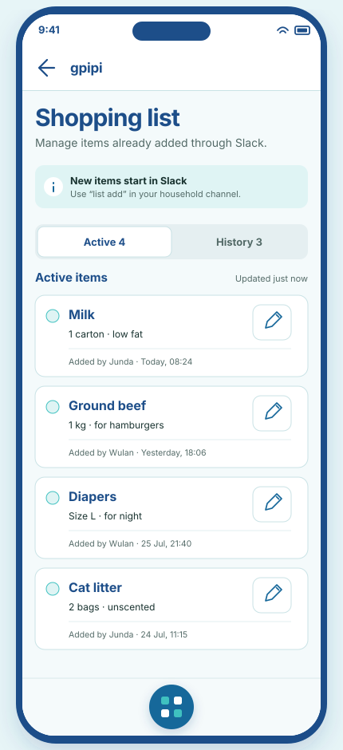
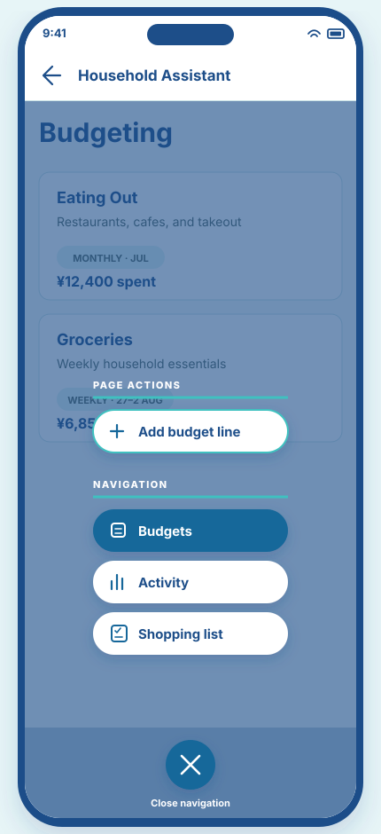
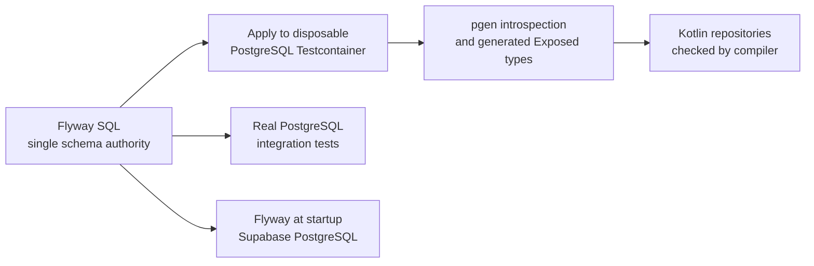
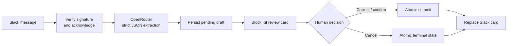

# gpipi

gpipi is a household assistant for recording expenses, keeping a shared shopping list, and reviewing household budgets. Everyday capture stays conversational; the companion web app handles the views and edits that benefit from more space.

## Slack workflows

Mention `@gpipi` in a channel to record an expense, add or check shopping items, or open the authenticated web app.

  

| Message | Result |
| --- | --- |
| `@gpipi 510 FamilyMart` | Extracts the expense and asks you to confirm its category. |
| `@gpipi list add milk, 2 eggs` | Extracts multiple shopping items and asks before adding them. |
| `@gpipi list` | Shows the active list with checkboxes for marking items bought. |
| `@gpipi open` | Sends a private, one-time authenticated link to the web app. |

## Continue in the web app

The responsive frontend has three primary destinations. Each mobile mockup is an SVG source asset, so it remains crisp and reviewable alongside the implementation.

<table>
  <tr>
    <th width="33%">Budgeting</th>
    <th width="33%">Activity</th>
    <th width="33%">Shopping list</th>
  </tr>
  <tr>
    <td></td>
    <td></td>
    <td></td>
  </tr>
  <tr>
    <td>Track weekly and monthly caps, utilization, and remaining budget.</td>
    <td>Review and filter expenses captured through Slack.</td>
    <td>Edit active items, mark them bought, and restore recent changes.</td>
  </tr>
</table>

## One launcher, contextual actions

The fixed launcher keeps navigation out of the way until it is needed. It always exposes the three main destinations and adds page-specific actions—such as **Add budget line**—without changing the launcher itself.

  

## Stack

| Boundary | Implementation |
| --- | --- |
| Conversation | Slack Events API and interactive Block Kit cards |
| Backend | Kotlin, Ktor, coroutines, and kotlinx.serialization |
| Structured extraction | OpenRouter with strict JSON Schema responses |
| State | PostgreSQL, Exposed transactions, and Flyway migrations |
| Frontend | React, Vite, Material UI, and TanStack Query |
| Runtime | Ktor on Fly.io in Tokyo; static frontend assets and same-origin `/api` proxy on Cloudflare |

## How it works

### One authoritative database schema

The database toolchain is deliberately shaped around one schema owner: the Flyway SQL migrations in `ktor/src/main/resources/db/migration`. Exposed never creates or evolves tables, and Supabase is only the hosted PostgreSQL service—there is no second Supabase migration history to keep synchronized.

For code generation, `pgenGenerateSpec` starts PostgreSQL 17 in Testcontainers, applies the real Flyway history, and introspects the resulting live schema. `pgenGenerateCode` turns that specification into the Exposed table objects used by the repositories. The application therefore queries through Kotlin mappings derived from PostgreSQL's actual interpretation of the migrations rather than through a second hand-maintained model.

The persistence tests use another real PostgreSQL Testcontainer and the production database bootstrap, so they apply the same migrations before exercising repositories, constraints, transactions, partial indexes, and advisory locks. At deployment, the Ktor application runs that same Flyway history in-process against Supabase before serving database traffic.

This moves a useful class of schema drift earlier: after regenerating the model, a renamed, removed, or incompatibly typed column that application code still references normally becomes a Kotlin compile error. PostgreSQL integration tests cover the things a type system cannot prove, such as constraints, indexes, SQL behavior, and transaction semantics.

That compile-time claim depends on regeneration. If a migration changes but `pgenGenerateSpec` is not run, the old committed specification can still generate stale types and compile. New tables must also be added to the pgen table allowlist. The safe schema-change workflow is therefore:

1. Add a Flyway migration.
2. Register any new table in the pgen allowlist.
3. Run `pgenGenerateSpec` and `pgenGenerateCode`.
4. Compile and run the Testcontainers-backed suite.

CI can make the boundary strict by regenerating from scratch and failing when the generated specification differs from the committed one. Additive columns that no code uses need not cause a compile error; semantic changes outside the generated type surface are intentionally left to the PostgreSQL tests.

### Passwordless authentication from Slack

The `open` command turns an already verified Slack identity into a short-lived browser session without introducing a second login:

1. Ktor generates a cryptographically random 32-byte nonce, stores only its SHA-256 hash with the Slack user ID, and gives it a 10-minute expiry.
2. The bot sends the raw nonce to that user in a private Slack card as `/enter#nonce`.
3. The browser reads the URL fragment and immediately removes it from the address bar. Fragments are not sent in HTTP requests, so the nonce does not enter normal server or proxy access logs.
4. The frontend posts the nonce to `/api/auth/redeem`. PostgreSQL atomically marks a matching, unexpired, unconsumed nonce as consumed and returns its Slack user ID; the same link cannot be redeemed twice.
5. Ktor issues a signed `HttpOnly`, `SameSite=Lax` session cookie (`Secure` in production). The cookie has an 8-hour lifetime and the signed payload has a 24-hour absolute age limit.

The browser never receives the Slack bot token, and the database never stores the raw login nonce.

### Human in the loop

The model proposes structured data; it does not get authority to make the final financial write.

For an expense, the confirmation card exposes the predicted category as an editable dropdown plus **Confirm** and **Not an expense** actions. Confirming consumes the pending draft, writes the expense, records the model's predicted category beside the human's final category, and marks the inbound message recorded in one database transaction. Cancelling changes the draft and inbound message to terminal non-expense states without creating an expense.

Shopping additions follow the same pattern: multilingual AI extraction creates a pending draft, and **Add items** or **Cancel** decides its outcome. Later actions are represented as mutations, which makes “mark bought” reversible and lets undo skip an item safely if someone changed it in the meantime.

### Idempotency and concurrent actions

Idempotency is enforced at the state transition, not only in request handlers:

- Every Slack `event_id` has a unique database constraint. `INSERT … ON CONFLICT DO NOTHING` makes a duplicate event stop before command execution.
- Expense and shopping drafts use conditional `UPDATE … WHERE status = 'PENDING' RETURNING …`. Only the first confirm or cancel wins; repeated button deliveries become no-ops.
- The draft transition, resulting records, audit event, and inbound status change share one PostgreSQL transaction. A failure rolls the complete state change back.
- Active shopping items have a normalized partial unique index over item, quantity, and note. Transaction-scoped advisory locks serialize competing operations for the same normalized identity.
- Web edits carry the item's expected mutation ID. Conditional updates reject stale clients instead of overwriting a newer change.
- An undo mutation has a unique reference to the mutation it reverses, so only the first undo can succeed.

### Retries and delivery guarantees

The system separates fast acknowledgement from slow AI and database work. Slack signatures are verified against the raw request body, then the endpoint returns `200` within Slack's three-second window and continues in an application-scoped coroutine. Request and Slack event IDs remain in the logging context across that asynchronous boundary.

| Boundary | Retry behavior | Effective guarantee |
| --- | --- | --- |
| Slack → Ktor | Retry-marked deliveries are acknowledged without reprocessing; the unique `event_id` also suppresses duplicate bodies. | Duplicate effects are suppressed, but processing is currently **at most once** after acknowledgement. |
| Database command | One-shot state transitions and a single transaction. | Exactly one committed database effect per draft or mutation. |
| Ktor → OpenRouter | Two retries for 5xx and non-timeout transport failures; 90-second request/socket timeout; no retry after timeout. | Avoids duplicate paid generations when a provider finishes after the client times out. |
| Ktor → Slack | Up to two retries with exponential backoff for 5xx and transport failures, with a 30-second request timeout. | Best-effort delivery; posts have no application idempotency key, so replay after an uncertain result can duplicate a message. |
| Database → Slack feedback | Commit first, then replace or post the Slack card. | Durable state wins, but the card can remain stale if the post-commit Slack call fails. |

There is intentionally no claim of end-to-end exactly-once delivery. Because Slack is acknowledged before work is durably queued, a process crash in that window can lose the event; because there is no transactional outbox, a committed change can outlive its Slack confirmation. A durable inbox/outbox worker would be the next step if those remaining windows need at-least-once processing and replayable delivery.

See the [design system](docs/design-system.md), [training Sheet import setup](docs/training-import-setup.md), [backend notes](ktor/README.md), and [frontend notes](web-app/README.md) for deeper product and implementation detail.
