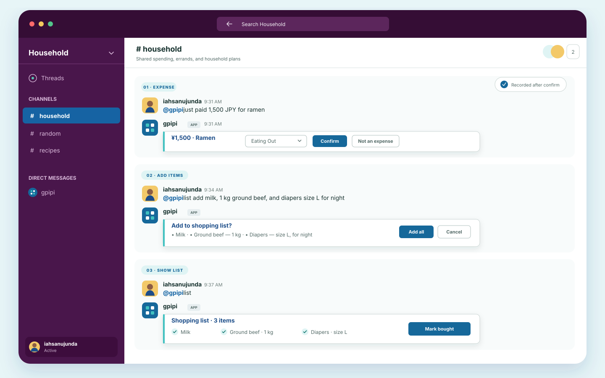
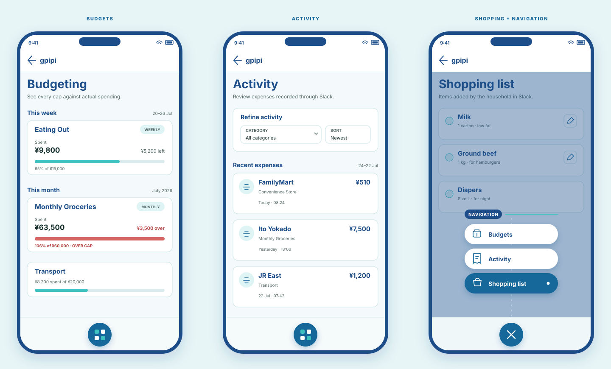

# gpipi

A household assistant for capturing everyday spending and keeping shared plans visible.

## Talk to it in Slack

Add an expense, build the shopping list, and bring the current list back into the conversation.

## See the household at a glance

Review budgets, browse expense activity, and manage the shopping list from one small web app.

