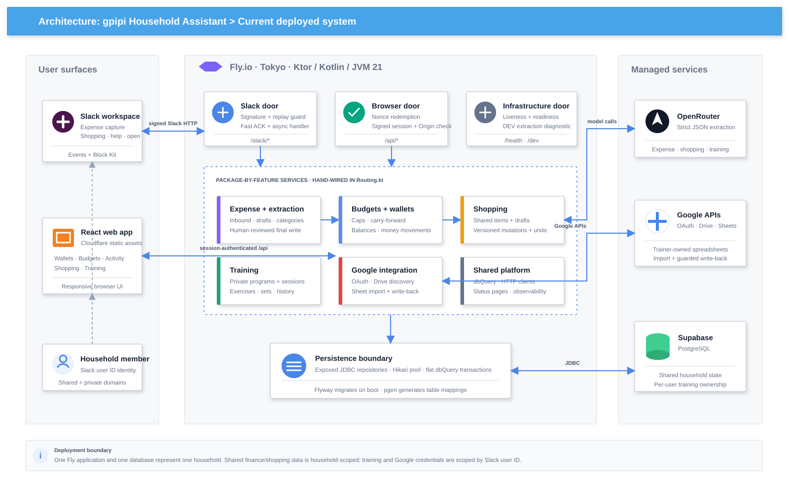
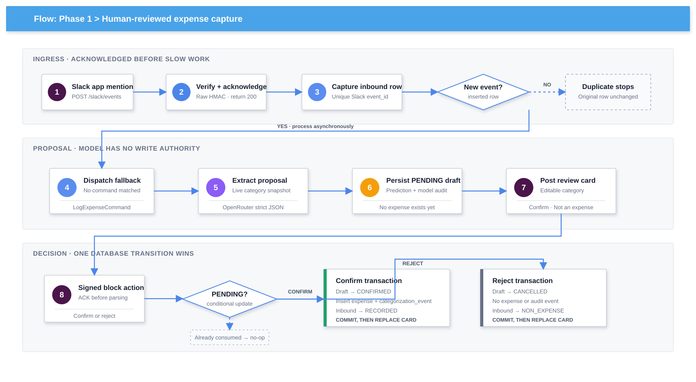
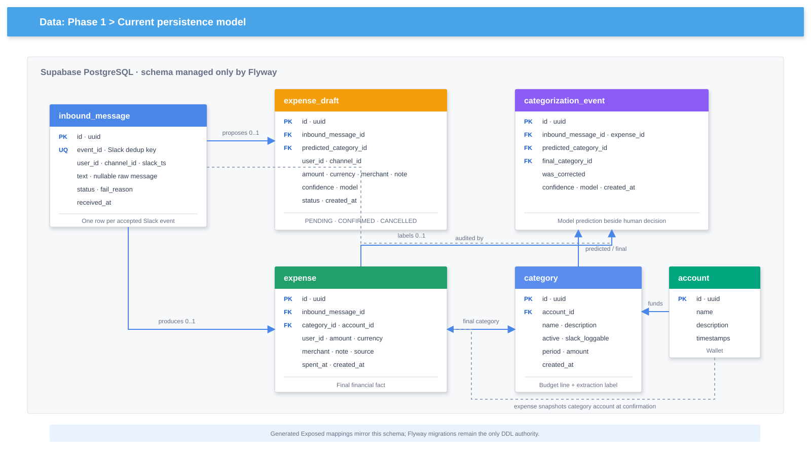
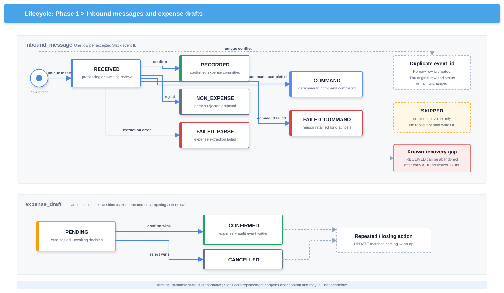

# gpipi Household Assistant — Architecture

_Current-state reference · Kotlin/Ktor · React · PostgreSQL · Slack · OpenRouter · Google Sheets · Fly.io · Cloudflare_

---

## Document role

This is the architecture reference for the application **as implemented in this repository**. The phase documents preserve the product's iteration plans, rationale, and remaining work; they are not the authority for current runtime behavior.

- [Phase 0](phase0.md): original environment and Slack setup plan.
- [Phase 1](phase1.md): Slack expense-capture roadmap and delivery status.
- [Phase 2](phase2.md): browser authentication, wallets, budgets, and finance UI plan.
- [Phase 3](phase3.md): shared shopping-list plan.
- [Phase 4](phase4.md): contingent in-house classification research plan.
- [Phase 5](phase5.md): private training and Google Sheet integration plan.

When a phase document and the code differ, this document should describe the code and the phase document should mark the original item shipped, superseded, or still pending.

## System context

gpipi is a single-household assistant with two user surfaces:

- Slack handles quick conversational actions: expense capture, shopping-list commands, help, and opening the browser app.
- A responsive React application handles views and edits that need more space: wallets, budgets, activity, shopping, and training.

One Ktor deployment is the backend for both surfaces. It owns the business rules and integrates with PostgreSQL, OpenRouter, Slack, and Google APIs.

<p align="center">
  <a href="diagram/system-architecture.svg">
    
  </a>
</p>

### Deployment units

| Unit | Runtime | Responsibility |
| --- | --- | --- |
| Slack app | Household Slack workspace | Signed events, interactive cards, and private app links |
| Web app | React/Vite static assets on Cloudflare | Responsive authenticated UI and client-side routing |
| Backend | Ktor on an always-on Fly Machine in Tokyo | Authentication, APIs, business rules, transactions, and integrations |
| Database | Supabase-hosted PostgreSQL | All durable application state and migration history |
| AI provider | OpenRouter | Strict structured extraction and training matching fallbacks |
| Trainer interface | Google Drive and Sheets | Third-party training-program source and execution write-back destination |

The Fly deployment uses blue/green replacement and dependency-free `/health` probes. The machine does not auto-stop because Slack requires an acknowledgement within three seconds.

## Trust, tenancy, and ownership

The deployment is intentionally single-tenant: one application and one database represent one household. No table carries a household or workspace key.

Slack user IDs are the application identity. The two ingress doors establish that identity differently:

```text
Slack request  → verified Slack signature → event.user
Browser request → one-time Slack-brokered nonce → signed UserSession cookie → session.userId
```

Data ownership then splits by domain:

| Scope | Domains | Enforcement |
| --- | --- | --- |
| Household-shared | Expenses, categories/budgets, wallets, money movements, shopping | No per-user read partition; actor IDs are retained where audit or concurrency rules need them |
| Per-person | Training programs, sessions, imports, Sheet writes, Google credentials | Every service query/mutation is constrained by the authenticated Slack user ID |

This is not a latent multi-tenant design. Supporting another household would require an explicit tenant key in Slack routing, sessions, unique constraints, repositories, and every shared-domain query.

## Runtime composition

Ktor does not scan for components. [`Routing.kt`](../ktor/src/main/kotlin/me/gpipi/Routing.kt) is the composition root: it creates HTTP clients, repositories, caches, services, Slack commands, and route adapters explicitly.

Application modules start in the order declared by [`application.conf`](../ktor/src/main/resources/application.conf):

1. request IDs and call logging;
2. JSON content negotiation;
3. exception-to-response mapping;
4. Hikari startup, Flyway migration, and Exposed connection;
5. signed cookie sessions and session authentication;
6. origin validation for unsafe browser API requests;
7. dependency construction and route registration.

The backend is organized by feature rather than technical layer:

```text
me.gpipi
├── slack/           signed adapters, Block Kit, command dispatch
├── auth/            nonce mint/redeem and session routes
├── inbound/         Slack capture, deduplication, and statuses
├── extraction/      expense prompt/schema and structured result
├── expense/         pending drafts, final expenses, activity reads
├── category/        budget lines, period math, carry-forward
├── account/         wallets, balances, movements, transaction feed
├── shopping/        shared items, mutation log, undo/version checks
├── training/        programs, workouts, sessions, performed sets
│   ├── imports/     persisted Google Sheet import/review workflow
│   ├── google/      OAuth, encrypted credentials, Drive/Sheets gateways
│   └── writes/      destination matching, preview, write, verification
├── ai/              provider-neutral structured extraction client
├── config/          database bootstrap and dbQuery transaction helper
├── health/          liveness and readiness routes
└── dev/             DEV-only extraction diagnostic
```

Repositories are plain classes that run inside caller-owned transactions. Services own business rules and transaction boundaries. `fun Route.xRoutes(deps)` functions are HTTP adapters. No DI framework, component scan, event bus, or ORM-managed schema lifecycle is present.

## Ingress and authorization boundaries

| Route group | Protection | Purpose |
| --- | --- | --- |
| `GET /health` | Public | Dependency-free process liveness |
| `GET /health/ready` | Public | PostgreSQL readiness via `SELECT 1` |
| `POST /slack/events` | Slack raw-body HMAC + five-minute replay window | App mentions and URL verification |
| `POST /slack/interactions` | Slack raw-body HMAC + five-minute replay window | Expense and shopping Block Kit actions |
| `POST /api/auth/redeem` | Exact configured browser `Origin` + single-use nonce | Establish browser session |
| `GET /api/auth/session` | Signed session cookie | Session inspection |
| `POST /api/auth/logout` | Signed session cookie + exact configured browser `Origin` | Session termination |
| Remaining `/api/**` | Signed session cookie; exact `Origin` on unsafe methods | Finance, shopping, and training APIs |
| `POST /dev/extract` | Registered only when `APP_ENV=DEV` | Local extraction diagnostic |

Slack verification is route-local so it does not accidentally protect browser or health routes. Browser origin validation is independent of CORS: CORS controls transport permission, while exact `Origin` comparison is the CSRF defense for cookie-authenticated writes.

## Slack door

### Event capture and command dispatch

The Slack event route verifies the raw request, handles the one-time URL challenge, acknowledges retry-marked deliveries without processing, and returns `200` before database or external calls. Work continues in an application-scoped coroutine with request and event IDs preserved in logging MDC.

`SlackEventHandler` accepts only complete `app_mention` messages, inserts `inbound_message` with `event_id` as a unique idempotency key, and chooses the first matching deterministic command:

| Match | Command | Domain |
| --- | --- | --- |
| `help`, `?`, `hi`, `hello`, `commands` | `HelpCommand` | Slack UX |
| `open …` | `OpenBudgetCommand` | Browser authentication |
| `list add …` | `ShoppingAddCommand` | Shopping extraction and draft |
| exact `list` | `ShoppingShowCommand` | Shared shopping list |
| fallback | `LogExpenseCommand` | Expense extraction and draft |

Matching does no I/O. Commands own their dependencies; the dispatcher owns capture, deduplication, selection order, and deterministic-command terminal statuses.

### Expense capture

<p align="center">
  <a href="diagram/phase1-expense-capture-flow.svg">
    
  </a>
</p>

The model proposes `amount`, JPY currency, merchant, category, confidence, and an optional verbatim note. It receives only active, Slack-loggable categories. The prompt and JSON Schema are built from the same category snapshot, and category is a strict enum.

Every expense currently requires human review. The Block Kit card preselects the prediction and offers **Confirm** and **Not an expense**. A conditional `PENDING` transition ensures only one action wins.

Confirm uses one transaction to:

1. consume the pending draft;
2. resolve the category's current wallet and insert the expense;
3. record predicted versus final category in `categorization_event`;
4. mark the inbound message `RECORDED`.

Reject cancels the draft and marks the inbound message `NON_EXPENSE` without producing an expense or label event. Slack feedback happens after commit.

### Shopping commands

`list add` uses a separate structured extraction service to turn free text into one or more item proposals. Confirmation creates shared `shopping_item` rows and a mutation record. `list` renders active items with interactive controls.

The shopping mutation log makes changes reversible. Active-item identity is normalized and protected by a partial unique index. Advisory locks serialize concurrent operations on the same normalized item. A web mutation must carry the item's current mutation ID; stale clients receive a conflict rather than overwriting newer state.

## Browser door

### Slack-brokered authentication

The browser has no password or standalone account system:

1. `OpenBudgetCommand` generates a cryptographically random nonce, stores only its SHA-256 hash with Slack user ID and expiry, and sends `/enter#nonce` privately in Slack.
2. The React entry page reads and immediately removes the URL fragment.
3. `POST /api/auth/redeem` atomically consumes a matching unexpired hash.
4. Ktor sets a signed `HttpOnly`, `SameSite=Lax` session cookie; it is `Secure` in production.

The cookie has an eight-hour browser lifetime and the signed payload has a 24-hour absolute-age check. It is signed, not encrypted; its only application data is Slack user ID and issue time.

### Frontend architecture

The frontend uses React Router, Material UI, TanStack Query, and a shared `apiFetch` wrapper with credentials included. `AuthProvider` resolves the session at startup, clears query state after logout or a 401, and exposes redeem/logout operations.

Primary navigation is:

| Surface | Main responsibility |
| --- | --- |
| Wallets | Derived balances, assigned budget lines, and paginated activity |
| Budgets | Category CRUD, weekly/monthly spend, and manual carry-forward |
| Activity | Filtered expense history |
| Shopping | Shared active/history list with optimistic-concurrency edits |
| Training | Private program, weekly execution, import, and Sheet write-back |

Route components own presentation and query orchestration; Ktor remains authoritative for validation, ownership, date buckets, balances, and state transitions.

## Finance domain

### Categories are budget lines

`category` is both the expense-classification label and the configurable budget line. Its description feeds the model; `active` and `slack_loggable` determine extraction eligibility; period and amount define the cap; `account_id` determines which wallet receives future expenses.

The active extraction catalog is cached for five minutes. A successful browser category mutation increments a generation and eagerly rebuilds it, preventing the old cache generation from being returned after the write.

Budget periods use `Asia/Tokyo`:

- weekly budgets use ISO Monday-to-Monday half-open windows;
- monthly budgets use household payday cycles based on the 25th, moved to the preceding Friday when it falls on a weekend.

Carry-forward is explicit, never automatic. A `budget_carry_forward` row snapshots source cap, incoming carry, source spend, and the resulting amount. Expected-value and unique-target checks make retries safe and reject stale previews.

### Wallets and balances

An account is an application wallet, not a bank connection. Balances are projections from recorded activity:

```text
wallet balance = incoming money movements - outgoing movements - assigned expenses
```

Money movement requests use a caller-supplied UUID idempotency key. Reusing the key with the same payload replays the original result; reusing it with different data is a conflict. Transfers may connect two tracked wallets or one tracked wallet and the external world, but cannot have no tracked endpoint or identical endpoints.

An expense snapshots the selected category's current `account_id` at confirmation. Later reassigning the category does not rewrite historical wallet activity.

### Expense reads

`GET /api/expenses` supports timestamp and category filters. Activity descriptions are derived from the retained Slack source text with amount/mention cleanup, falling back to the model note when required. The API is read-only; recorded-expense editing is not implemented.

<p align="center">
  <a href="diagram/phase1-data-model.svg">
    
  </a>
</p>

## Training domain

Training is the first per-person domain. Programs, imports, sessions, writes, and Google credentials are resolved through the authenticated Slack user ID.

### Program and execution model

The hierarchy is:

```text
program
└── workout
    └── workout_week
        ├── workout_group
        │   └── prescription → exercise
        └── training_session
            └── performed_exercise
                └── performed_set
```

Weeks are authored program structure, not calendar recurrence. Workouts may have different movement groups and prescription prose. Performed sets store typed execution values separately from prescription text. Session `execution_updated_at` advances only for data that would change a Sheet write; metadata-only edits do not falsely mark execution unsynchronized.

The service enforces owner scope on every read and mutation. It supports starting, editing, finishing, resuming, skipping, and restoring workout execution while preserving the distinction between an authored skipped week and a completed session.

### Google connection and import

Google OAuth credentials are encrypted before persistence and belong to one Slack user. Drive discovery returns short-lived opaque selection tokens rather than exposing arbitrary spreadsheet IDs as trusted input.

A training import is a persisted review workflow, not a single API call. It records discovered tabs/weeks, structured extraction output, exercise matches, and Sheet provenance before applying a reviewed week to an existing owned program. Imported execution cells are ignored; the Sheet's prescription side is the import source.

### Execution write-back

Writing a completed workout is also persisted as a state machine:

1. resolve or choose a spreadsheet, tab, and target week;
2. scan the live Sheet rather than trusting old coordinates;
3. deterministically match where possible and use the training extraction model only as a fallback;
4. persist the exact cell replacements and payload hash;
5. present a preview;
6. validate anchors immediately before sending;
7. write through Google Sheets and verify uncertain outcomes.

`sheet_write`, `sheet_write_movement`, and `sheet_write_cell` retain the proposed destination and payload. Statuses distinguish review, prepared, sending, succeeded, unknown, and verification conflict states so a timeout is not treated as a safe blind retry.

## AI and external integration boundary

`OpenRouterClient` sends chat-completions requests with strict JSON Schema, required provider parameter support, and response healing. The configured default is `deepseek/deepseek-v4-flash`; training extraction can use a separately configured model and high reasoning effort.

Callers define their own extraction specification:

| Caller | Model task |
| --- | --- |
| Expense extraction | Amount, merchant, category, confidence, verbatim note |
| Shopping extraction | One or more normalized item proposals |
| Training import | Spreadsheet prescription structure |
| Training write matching | Ambiguous movement-to-row matching fallback |

The model never receives database credentials and never executes SQL. Business services validate its structured result and retain provider-returned model identity where auditability matters.

External calls stay outside database transactions. Google and Slack gateways translate transport/provider failures into domain-specific outcomes where recovery needs to be surfaced to the user.

## Persistence architecture

### Schema authority

Flyway SQL under [`ktor/src/main/resources/db/migration`](../ktor/src/main/resources/db/migration) is the only DDL authority. Migrations run in-process before routes are composed. Supabase CLI migrations are deliberately unused.

pgen applies the Flyway history to disposable PostgreSQL, introspects the resulting schema, and generates Exposed table mappings under `me.gpipi.generated.db.base.public1`. Mappings are query types, not an independent schema definition.

Schema changes follow this sequence:

1. add a forward-only Flyway migration;
2. add any new table to the pgen allowlist in `build.gradle.kts`;
3. regenerate `pgen-spec.json` and generated code;
4. compile and run the PostgreSQL-backed tests.

### Table ownership

| Domain | Tables |
| --- | --- |
| Slack/expense | `inbound_message`, `expense_draft`, `expense`, `categorization_event` |
| Browser auth | `auth_nonce` |
| Budgets/wallets | `category`, `account`, `money_movement`, `budget_carry_forward` |
| Shopping | `shopping_add_draft`, `shopping_add_draft_item`, `shopping_item`, `shopping_mutation`, `shopping_mutation_item` |
| Training execution | `exercise`, `exercise_alias`, `program`, `workout`, `workout_week`, `workout_group`, `prescription`, `training_session`, `performed_exercise`, `performed_set` |
| Google/import | `google_credential`, `google_oauth_state`, `training_import`, `training_import_tab`, `training_import_week`, `training_import_exercise_match`, `sheet_link`, `sheet_week_link`, `sheet_prescription_link` |
| Sheet write-back | `sheet_write`, `sheet_write_movement`, `sheet_write_cell` |

### Transaction discipline

[`dbQuery`](../ktor/src/main/kotlin/me/gpipi/config/DbQuery.kt) is the request-path database entry point. It uses `Dispatchers.IO` for blocking JDBC and Exposed `suspendTransaction` for coroutine-aware transaction context.

- repositories never open nested request transactions;
- multi-record invariants use one flat `dbQuery` block;
- network calls never run inside database transactions;
- conditional updates, unique constraints, foreign keys, and advisory locks enforce races at the state boundary;
- side effects such as Slack card replacement happen after commit.

## Concurrency, idempotency, and delivery

| Boundary | Mechanism | Effective behavior |
| --- | --- | --- |
| Slack event | Unique `inbound_message.event_id` | Duplicate command effects suppressed |
| Expense decision | `UPDATE … WHERE status = 'PENDING' RETURNING` | Only one confirm/reject wins |
| Auth link | Atomic consume of unexpired, unused nonce hash | Link is single-use under concurrent redemption |
| Money movement | Unique idempotency key plus payload comparison | Safe replay; mismatched reuse conflicts |
| Carry-forward | Unique category/cadence/target plus expected amount | Same write replays; stale calculation conflicts |
| Shopping edit | Expected mutation ID | Stale client cannot overwrite a newer item |
| Shopping undo | Unique reversal reference and current-state checks | One safe reversal; independently changed items are skipped |
| Training Sheet write | Persisted payload, state transitions, anchor validation, verification | Uncertain external outcomes are not blindly repeated |

The system does **not** provide end-to-end exactly once delivery. Slack is acknowledged before work is durably queued, so a process crash in that interval can lose the event. Database commit precedes Slack feedback, so durable state can outlive a stale card. There is no transactional inbox/outbox worker.

<p align="center">
  <a href="diagram/phase1-lifecycle-states.svg">
    
  </a>
</p>

## Security and privacy

- Secrets come from local `.env` or Fly secrets and are never embedded in the image or repository.
- Slack requests use raw-body HMAC verification and a replay window.
- Browser sessions are signed, `HttpOnly`, `SameSite=Lax`, and `Secure` in production.
- Unsafe `/api` requests require an exact trusted `Origin` even when CORS permits the transport.
- Raw login nonces are never stored; Google credentials are encrypted before storage.
- Raw Slack text and spreadsheet content are sent to configured third-party processors.
- There is no implemented TTL/redaction job for `inbound_message.text`.
- The single-household deployment and private Slack workspace are part of the authorization model.

## Operations and observability

The backend fails startup when required Slack or OpenRouter configuration is blank, when database migration fails, or when required session configuration is absent. Slack, OpenRouter, and Google clients plus the Hikari pool close on application shutdown.

`X-Request-ID` is accepted only when it matches a constrained safe character set; otherwise Ktor generates a UUID. Call logging excludes `/health`. Async Slack processing carries request and Slack event IDs through coroutine MDC.

Health semantics are split:

- `/health` proves that the process can answer HTTP without touching dependencies;
- `/health/ready` proves PostgreSQL reachability and returns `503` on failure.

Production uses Gradle `installDist`, not a shaded jar, because separate Flyway dependency jars must retain their service-loader registrations. The multi-stage Docker build uses JDK/JRE 21 and needs no live database when compiling from committed `pgen-spec.json`.

## Testing architecture

Backend tests combine focused unit tests, Ktor route tests, MockWebServer-style fake HTTP endpoints, and real PostgreSQL Testcontainers. Persistence tests use the production `connectDatabase` path, so the actual Flyway history, PostgreSQL constraints, indexes, advisory locks, and transaction semantics are exercised.

Frontend tests use Vitest with jsdom for component behavior and Playwright for responsive, navigation, mutation, and training workflows. The Playwright fake API supplies deterministic server behavior; backend route and persistence tests remain responsible for the real API/database contract.

Primary verification commands:

```bash
cd ktor && ./gradlew test
cd web-app && npm test
cd web-app && npm run test:e2e
```

## Known architectural limits

These are current facts, not automatically approved roadmap items:

- no multi-household tenancy key or workspace allowlist;
- no durable Slack inbox/outbox or recovery worker;
- no raw-message retention job;
- no merchant-hint feedback table or confidence-based auto-record path;
- no in-house expense classifier; structured extraction remains OpenRouter-backed;
- no edit flow for an already recorded expense;
- no natural-language Slack finance queries or budget mutations;
- no bank synchronization; wallet balances are application projections;
- Slack expense confirmation records the original author, not the member who clicked the shared card;
- Google Sheets remains an external mutable source/destination, so write-back can reduce but not eliminate read/write races.

Delivery status and deferred Phase 1 ideas are tracked in [Phase 1](phase1.md#current-delivery-status).

## Source map

| Concern | Primary source |
| --- | --- |
| Composition root and route boundaries | [`Routing.kt`](../ktor/src/main/kotlin/me/gpipi/Routing.kt) |
| Application module order | [`application.conf`](../ktor/src/main/resources/application.conf) |
| Slack adapters and dispatch | [`SlackRoutes.kt`](../ktor/src/main/kotlin/me/gpipi/slack/SlackRoutes.kt), [`SlackEventHandler.kt`](../ktor/src/main/kotlin/me/gpipi/slack/SlackEventHandler.kt) |
| Browser auth and security | [`AuthRoutes.kt`](../ktor/src/main/kotlin/me/gpipi/auth/AuthRoutes.kt), [`Security.kt`](../ktor/src/main/kotlin/me/gpipi/Security.kt), [`OriginProtection.kt`](../ktor/src/main/kotlin/me/gpipi/OriginProtection.kt) |
| Finance services | [`category`](../ktor/src/main/kotlin/me/gpipi/category), [`account`](../ktor/src/main/kotlin/me/gpipi/account), [`expense`](../ktor/src/main/kotlin/me/gpipi/expense) |
| Shopping services | [`shopping`](../ktor/src/main/kotlin/me/gpipi/shopping) |
| Training services | [`training`](../ktor/src/main/kotlin/me/gpipi/training) |
| Database bootstrap and transactions | [`Database.kt`](../ktor/src/main/kotlin/me/gpipi/config/Database.kt), [`DbQuery.kt`](../ktor/src/main/kotlin/me/gpipi/config/DbQuery.kt) |
| Schema history | [`db/migration`](../ktor/src/main/resources/db/migration) |
| Frontend route map | [`router.jsx`](../web-app/src/app/router.jsx) |
| Production deployment | [`fly.toml`](../ktor/fly.toml), [`Dockerfile`](../ktor/Dockerfile), [`wrangler.jsonc`](../web-app/wrangler.jsonc) |
