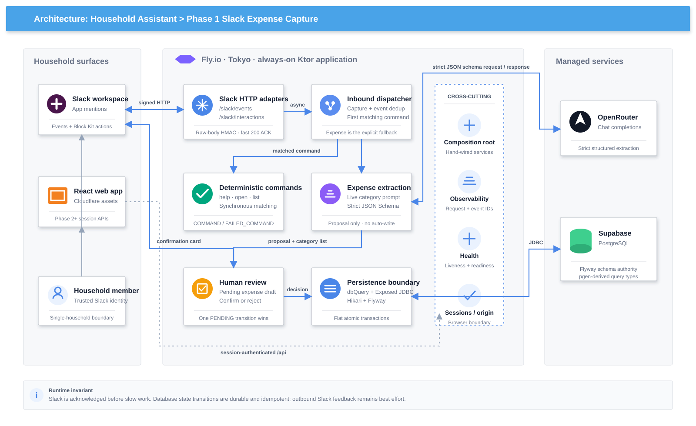

# Household Assistant — Phase 1: Slack Expense Capture Plan

_Roadmap and delivery record · Slack · Ktor · Supabase PostgreSQL · Exposed/JDBC · Flyway · OpenRouter · Fly.io_

---

## Overview

> **Document role:** this file preserves the original Phase 1 iteration plan and records what shipped, what was superseded, and what remains. See [architecture.md](architecture.md) for the current whole-system architecture.

A private Slack workspace for the household. Either spouse posts a natural-language expense — `@ai just paid 1500jpy for ramen` — and the bot records the amount, assigns the correct budget category, and timestamps it. No spreadsheet, no nightly recap.

The target core loop was: **Slack message → Ktor acks within 3s → single LLM extraction (retrieval-then-generate) → confidence gate → auto-record or editable confirmation card → atomic write + hint upsert → the feedback loop improves the next categorization.**

The shipped loop currently stops at mandatory human review: **Slack message → fast ack → strict extraction → pending draft → editable confirmation card → atomic confirm/reject**. Merchant hints and confidence-based auto-recording remain unimplemented.

Categorization is the only part that needs a model. The amount is trivially parseable; the value is in mapping messy JP/EN merchant text (`ito yokado`, `イトーヨーカドー`, `conbini`, `セブン`) to the right budget line, and in disambiguating cases like ¥510 at a konbini (weekly food) vs ¥7,500 at Tokyu Store (monthly groceries).

### Iteration Order Rationale

| # | Scope | Delivery status | Why This Order |
|---|-------|-----------------|----------------|
| 1 | Walking Skeleton — Slack signing + async ack (Ktor) | **Shipped** | Prove the 3s-ack/cold-start reality before anything else depends on it |
| 2 | Thinnest Extraction — one LLM call → Supabase → text reply | **Shipped, then superseded by review cards** | Kills the Google Sheet on day one; starts generating real messages |
| 3 | Config-Driven Categories | **Shipped** | Move categories to DB, inject descriptions — enables the konbini-vs-Tokyu disambiguation |
| 4 | Inline Confirmation Card + Labeled Events | **Shipped** | One-tap correction; every confirm/correct becomes a labeled pair |
| 5 | Merchant Hints Feedback Loop | **Not started** | Only possible once iter 4 has been logging confirmations |
| 6 | Confidence Gate | **Not started** | "High confidence" is meaningless until hints exist and the real distribution is visible |
| 7 | Frontend → **see Phase 2** | **Core frontend shipped; savings still deferred** | Full frontend (auth, expenses, payday, budgets, savings) is a separate document — Phase 2 |
| 8 | Query Path (post-MVP) | **Not started** | Read side; deliberately last, deterministic SQL over agent loops |

**Capture-first, not schema-first.** Unlike a seed-driven app, the data this system learns from (merchant→category hints) is *manufactured by dogfooding*. Stand up the loop that produces confirmed labels before building the thing that consumes them — same instinct as the PokeOps silver-label path.

## Current delivery status

| State | Meaning in this document |
| --- | --- |
| **Shipped** | Present in the current code and covered by the repository's tests |
| **Superseded** | Built as a stepping stone, but the current flow deliberately uses a later design |
| **Not started** | No production schema or execution path exists yet |
| **Operational verification** | Code exists, but a real-workspace/mobile acceptance check is still intentionally unchecked |

The current implementation, security boundaries, state machines, and known failure windows live in [architecture.md](architecture.md). The checklists below are updated against the repository, while real-device or production-only acceptance items remain open when the code cannot prove them.

---

## Message Extraction Reference

### Example Inputs → Extracted Record

| Input | `amount` | `currency` | `merchant` | `category` | `confidence` |
|-------|----------|------------|-----------|------------|--------------|
| `just paid 1500jpy for ramen` | 1500 | JPY | null | Eating Out | high |
| `groceries at ito yokado, spent 7000jpy` | 7000 | JPY | Ito Yokado | Monthly Groceries | high |
| `spent 510 in conbini` | 510 | JPY | conbini | Convenience Store | high |
| `7500 tokyu store` | 7500 | JPY | Tokyu Store | Monthly Groceries | medium |
| `2000 for something` | 2000 | JPY | null | (best guess) | low |

The konbini-vs-Tokyu split falls out cleanly when the model has **category descriptions**, not bare labels, plus the amount as a strong prior. `¥510` + konbini and `¥7,500` + supermarket separate on both signals.

### Inbound Message Status Reference

Every `@ai` message is captured to `inbound_message` (see 2.1) — including the ones that fail. The failures are the point: they're the debugging corpus for prompt tuning (iter 5–6) and the replay set for evaluating a new prompt or model against real historical inputs. The `status` field records the outcome.

| Status | Meaning | Links to expense? |
|--------|---------|-------------------|
| `RECEIVED` | Landed, not yet processed | no |
| `RECORDED` | Extracted and written (auto or confirmed) | yes |
| `COMMAND` | A deterministic command completed successfully | no |
| `FAILED_COMMAND` | A deterministic command failed — reason retained for diagnosis | no |
| `FAILED_PARSE` | LLM returned invalid/unusable output — raw text kept for debugging | no |
| `NON_EXPENSE` | Classified or explicitly rejected by a member as not an expense | no |
| `SKIPPED` | Enum value only; current duplicate handling creates no new row and leaves the original status unchanged | — |

`FAILED_PARSE` rows are the goldmine for prompt work; `NON_EXPENSE` rows become the training set for the iter-8 intent classifier.

### Planned Confidence Gate Reference (Iteration 6 — not shipped)

| Condition | Action | Slack surface |
|-----------|--------|---------------|
| Merchant in `merchant_category_hint` | Auto-record | `Recorded ✓ · tap to edit` (passive) |
| No hint, model `confidence >= 0.8` | Auto-record | `Recorded ✓ · tap to edit` (passive) |
| No hint, `confidence < 0.8` | Require confirm | Editable card, `Confirm` or `Not an expense` |
| Unknown merchant, low confidence | Require confirm | Editable card, category dropdown open plus `Not an expense` |

The routine ¥510 conbini spend just records. Only genuinely ambiguous ones stop you.

---

# Iteration 1 — Walking Skeleton: Slack Signing + Async Ack

No DB, no AI. Verify the signing secret, ack within 3s, echo the text back via `chat.postMessage`. The entire point is to hit the cold-start reality immediately and make the hosting decision with real feel.

**Status: shipped.** The echo was the walking-skeleton proof and was later replaced by real command responses. Production now runs as an always-on Fly Machine in Tokyo rather than the originally evaluated Render service.

### 1.1 Architecture

<p align="center">
  <a href="diagram/phase1-system-architecture.svg">
    
  </a>
</p>

```
Slack Events API
  → POST /slack/events (Ktor)
    → verify X-Slack-Signature (HMAC-SHA256, replay window)
    → handle url_verification challenge (setup only)
    → dedup on event_id (Slack RETRIES on timeout)
    → respond 200 IMMEDIATELY (<3s)
    → applicationScope.launch { handleEvent(...) }   // async, survives response
        → chat.postMessage(echo)
```

### 1.2 Signature Verification

Slack signs every request. Base string is `v0:{timestamp}:{rawBody}`, signed with the signing secret, compared against `X-Slack-Signature`.

```kotlin
fun verifySlackSignature(headers: Headers, rawBody: String, signingSecret: String): Boolean {
    val timestamp = headers["X-Slack-Request-Timestamp"]?.toLongOrNull() ?: return false
    // Replay guard — reject anything older than 5 minutes
    if (abs(Instant.now().epochSecond - timestamp) > 60 * 5) return false

    val basestring = "v0:$timestamp:$rawBody"
    val mac = Mac.getInstance("HmacSHA256").apply {
        init(SecretKeySpec(signingSecret.toByteArray(), "HmacSHA256"))
    }
    val computed = "v0=" + mac.doFinal(basestring.toByteArray()).toHexString()
    val provided = headers["X-Slack-Signature"] ?: return false
    return MessageDigest.isEqual(computed.toByteArray(), provided.toByteArray()) // constant-time
}
```

> Verify against the **raw** request body, before any deserialization. Read the body as text once, verify, then parse.

### 1.3 The Ack Pattern

```kotlin
post("/slack/events") {
    val raw = call.receiveText()
    if (!verifySlackSignature(call.request.headers, raw, signingSecret)) {
        call.respond(HttpStatusCode.Unauthorized); return@post
    }
    val payload = json.decodeFromString<SlackEnvelope>(raw)

    if (payload.type == "url_verification") {          // one-time setup handshake
        call.respondText(payload.challenge!!); return@post
    }
    // Slack retries on any non-200 within 3s — early-return on retries
    if (call.request.headers["X-Slack-Retry-Num"] != null) {
        call.respond(HttpStatusCode.OK); return@post
    }

    call.respond(HttpStatusCode.OK)                    // ACK within 3s — nothing heavy before this line
    applicationScope.launch { handleEvent(payload) }   // app-scoped, NOT the call scope
}
```

> Use an application-scoped `CoroutineScope`, not the request's scope — otherwise the work is cancelled when the response returns.

### 1.4 Hosting Decision — shipped on Fly.io

Slack disables an event subscription after repeated ack failures, so the backend must not sleep between household messages. The original plan compared Render tiers; the shipped decision is encoded in [`ktor/fly.toml`](../ktor/fly.toml): one always-on Fly Machine in `nrt`, with auto-stop disabled and a blue/green deployment strategy.

Supabase remains the hosted PostgreSQL provider. Fly runs the Ktor process only; it does not own application data.

### 1.5 Socket Mode Note

Socket Mode (WebSocket initiated from the server) avoids needing a public URL, but still requires a non-sleeping process — it does **not** solve cold starts. HTTP Events + Starter is simpler here. Revisit Socket Mode only if you want to drop the public endpoint.

### 1.6 Health Check (Liveness)

`/health` is infrastructure, not a feature — it lives in its own `health/` package, **outside** the Slack signature verification. It must be cheap and dependency-free (no DB, no external calls): Fly probes it frequently for deploy gating, so a DB round-trip here would hammer Postgres and let a transient dependency blip cycle the instance.

```kotlin
// health/HealthRoutes.kt
fun Route.healthRoutes() {
    get("/health") {                           // liveness — no dependencies
        call.respond(HttpStatusCode.OK, mapOf("status" to "up"))
    }
    // iteration 2: /health/ready does a SELECT 1 via dbQuery (readiness)
}
```

Wire it public, alongside (not inside) the verified Slack group — the reason verification is per-route inside `slackRoutes` rather than a global plugin is precisely so `/health` can answer 200 with no signature:

```kotlin
routing {
    healthRoutes()                                     // public, unauthenticated
    slackRoutes(slack, expenseService, signingSecret)  // verification inside this group
}
```

Fly's HTTP service health check points at `/health`. `/health/ready` is available for dependency diagnosis but is intentionally not the machine liveness probe.

### Definition of Done

- [x] Slack app created, event subscription pointed at `/slack/events`
- [x] `url_verification` challenge is implemented and route-tested
- [x] Signature verification rejects bad signatures and stale timestamps
- [x] Endpoint acknowledges before database, AI, or Slack Web API work; production avoids cold starts with an always-on machine
- [x] Async response path proved by the echo and now used by real command handlers
- [x] Retry requests (`X-Slack-Retry-Num`) short-circuit to 200
- [x] `/health` liveness returns 200 with no DB/external dependency, reachable without a Slack signature
- [x] Fly liveness check points to `/health`
- [x] Always-on Fly deployment selected and configured

---

# Iteration 2 — Thinnest Extraction: One LLM Call → Supabase → Text Reply

The moment this ships, the nightly recap dies. Categories are hardcoded in the prompt for now — DB-driven categories come in iteration 3.

**Status: shipped as the extraction and persistence foundation, then superseded at the final step.** The current flow stores an `expense_draft` and posts an editable review card; it does not insert an expense or mark the inbound message `RECORDED` until the member confirms. The schema and direct-write snippets below describe the iteration's original stepping stone, not current control flow.

### 2.0 Persistence Setup (Exposed + Flyway)

Dependencies (as wired in `ktor/build.gradle.kts` — Exposed moved to a `v1` package namespace in the 1.x line, so imports are `org.jetbrains.exposed.v1.*`):

```
org.jetbrains.exposed:exposed-core:1.3.1
org.jetbrains.exposed:exposed-jdbc:1.3.1          # blocking JDBC path (not R2DBC)
org.jetbrains.exposed:exposed-java-time:1.3.1     # timestamp column support — see note
org.postgresql:postgresql:42.7.12                 # JDBC driver
com.zaxxer:HikariCP:7.1.0                          # connection pool
org.flywaydb:flyway-core:12.10.0                   # migrations
org.flywaydb:flyway-database-postgresql:12.10.0
```

> **All three Exposed modules must be the same version** (`1.3.1`) — mixing them causes subtle breakage. **`exposed-java-time` must be `implementation`, not `runtimeOnly`**: the timestamp column DSL (`timestampWithTimeZone(...)`, `CurrentTimestampWithTimeZone`) has to be on the *compile* classpath, or the `Table` objects won't compile.

**Schema source of truth = Flyway SQL migrations.** Exposed `Table` objects *mirror* the migrations — they're the query mapping, not the schema authority. Do **not** use `SchemaUtils.create`/`createMissingTablesAndColumns` as your prod schema mechanism — it's convenient for a throwaway local DB but not migration-safe. Flyway owns DDL; Exposed owns queries.

> **pgen generates the Exposed mirrors.** Rather than hand-writing `Table` objects, the project uses the pgen Gradle plugin (`de.quati.pgen`) to generate them from the live schema. Generated classes live at `me.gpipi.generated.db.base.public1.*` (e.g. `InboundMessage`, `Expense`, `Category`). The code examples in this doc show the conceptual shape; the real imports are from the generated package. The discipline is unchanged: Flyway owns DDL, generated Exposed classes own queries.

> **Migrations are packaged with the app, on the classpath.** Flyway runs as a *library* (in-process, on boot via `migrate()`), not the CLI — so the SQL files ship inside the jar at `ktor/src/main/resources/db/migration/` (Flyway's default `classpath:db/migration` location, no `.locations(...)` override needed). This version-locks schema to the code that expects it: one jar carries exactly the schema it was written against, local and prod alike.
>
> **One authority, not two.** The repo also has a `supabase/` directory (Supabase CLI init). Supabase is used **only as the hosted Postgres** — its `supabase/migrations/` stays empty and `supabase db push` is never run. Flyway's boot-time `migrate()` is the *sole* thing that touches DDL. A stray `supabase migration new` / `db push` would create a second, competing migration history — don't.

Connection is a real module in `config/Database.kt`, wired into the `application.conf` module chain as `me.gpipi.config.DatabaseKt.configureDatabase` (ahead of `configureRouting`, so the DB is ready before routes bind):

```kotlin
// config/Database.kt
data class DbConfig(val url: String, val user: String, val password: String, val maxPoolSize: Int)

fun ApplicationConfig.dbConfig() = DbConfig(
    url = property("db.url").getString(),           // db.url ← DATABASE_URL (see application.conf)
    user = property("db.user").getString(),         // db.user ← DATABASE_USER
    password = property("db.password").getString(), // db.password ← DATABASE_PASSWORD
    maxPoolSize = property("db.maxPoolSize").getString().toInt(),   // default 5
)

// Holds both so the pool can be closed on shutdown; Database alone can't close the pool.
data class Db(val database: Database, val dataSource: HikariDataSource)

fun connectDatabase(cfg: DbConfig): Db {
    val pool = HikariDataSource(HikariConfig().apply {
        jdbcUrl = cfg.url
        username = cfg.user            // credentials passed explicitly, NOT in the URL query string —
        password = cfg.password        // Hikari's username/password win, so local and prod resolve the same way
        maximumPoolSize = cfg.maxPoolSize
        // Supabase pooler (Supavisor, transaction mode) — disable JDBC prepared-statement
        // caching or use the session-mode port. Set on the connection string / here when you
        // point db.url at the real Supabase pooler.
    })
    Flyway.configure().dataSource(pool).load().migrate()   // migrations run before first query
    return Db(Database.connect(pool), pool)                // Exposed binds to the pool
}

val DbKey = AttributeKey<Db>("Db")

fun Application.configureDatabase() {
    val db = connectDatabase(environment.config.dbConfig())
    monitor.subscribe(ApplicationStopped) { db.dataSource.close() }   // release the pool on shutdown
    attributes.put(DbKey, db)                                          // routes read attributes[DbKey]
}
```

> The connected `Db` is stashed in application attributes under `DbKey`; `configureRouting` reads `attributes[DbKey].database` and threads it into `slackRoutes(signingSecret, db)` → `handleEvent(payload, db)`. `connectDatabase` is also reused by the test harness (`TestPostgres`) so prod and test share one connect path.

### 2.1 Schema (initial)

Flyway migration `V1__inbound_and_expense.sql`:

```sql
-- Capture EVERY @ai message here, including failures. This is the debugging
-- corpus, the replay set, and the dedup key — all in one table.
create table inbound_message (
    id          uuid primary key default gen_random_uuid(),
    event_id    text        not null unique,   -- Slack event_id; also the dedup key
    user_id     text        not null,
    channel_id  text        not null,
    text        text,                           -- raw @ai message; nullable so it can be TTL'd (appendix)
    slack_ts    text        not null,           -- Slack's message timestamp
    status      text        not null default 'RECEIVED',  -- see Inbound Message Status Reference
    fail_reason text,
    received_at timestamptz not null default now()
);

create table expense (
    id                  uuid primary key default gen_random_uuid(),
    inbound_message_id  uuid        not null references inbound_message(id),  -- source of raw text
    user_id             text        not null,          -- Slack user id
    amount              bigint      not null,          -- integer JPY (no minor unit); multi-currency later
    currency            text        not null default 'JPY',
    category            text        not null,          -- free text for now; FK in iter 3
    merchant            text,
    note                text,
    spent_at            timestamptz not null default now(),
    source              text        not null default 'SLACK',
    created_at          timestamptz not null default now()
);
```

Exposed `Table` objects mirroring the above (query mapping). Per package-by-feature (see Appendix), these live **with their feature**, not in one shared package: `InboundMessages` in `inbound/`, `Expenses` in `expense/`. The FK just means `expense/` imports from `inbound/` (a fine dependency direction).

v1 import paths (the namespace moved — the old `org.jetbrains.exposed.*` paths are stale):
- `UUIDTable` → `org.jetbrains.exposed.v1.core.dao.id.UUIDTable`
- `text` / `long` / `reference` / `.nullable()` / `.default()` / `.uniqueIndex()` → `org.jetbrains.exposed.v1.core.*`
- timestamp columns + `CurrentTimestampWithTimeZone` → `org.jetbrains.exposed.v1.javatime.*`

```kotlin
object InboundMessages : UUIDTable("inbound_message") {
    val eventId     = text("event_id").uniqueIndex()
    val userId      = text("user_id")
    val channelId   = text("channel_id")
    val text        = text("text").nullable()
    val slackTs     = text("slack_ts")
    val status      = text("status").default("RECEIVED")
    val failReason  = text("fail_reason").nullable()
    val receivedAt  = timestampWithTimeZone("received_at").defaultExpression(CurrentTimestampWithTimeZone)
}

object Expenses : UUIDTable("expense") {
    val inboundMessageId = reference("inbound_message_id", InboundMessages)
    val userId    = text("user_id")
    val amount    = long("amount")
    val currency  = text("currency").default("JPY")
    val category  = text("category")
    val merchant  = text("merchant").nullable()
    val note      = text("note").nullable()
    val spentAt   = timestampWithTimeZone("spent_at").defaultExpression(CurrentTimestampWithTimeZone)
    val sourceCol = text("source").default("SLACK")   // NOT `source`: clashes with ColumnSet.source
    val createdAt = timestampWithTimeZone("created_at").defaultExpression(CurrentTimestampWithTimeZone)
}
```

> **`timestamptz` → `timestampWithTimeZone`, not `timestamp`.** In `exposed-java-time`, `timestamp("...")` maps to a plain `timestamp` (Kotlin `Instant`), while `timestampWithTimeZone("...")` maps to `timestamptz` (Kotlin `OffsetDateTime`). Since the migration DDL is the authority and it says `timestamptz`, the mirror uses `timestampWithTimeZone` to stay faithful.
>
> **The default expression must match the column type.** Pair `timestampWithTimeZone` with `CurrentTimestampWithTimeZone` (both `OffsetDateTime`); `CurrentTimestamp` is `Instant`-typed and belongs to plain `timestamp` columns — mixing them is a compile error (`Argument type mismatch: … but 'Expression<OffsetDateTime>' was expected`).
>
> **Watch for property names that clash with `Table`/`ColumnSet` members.** A column named `source` can't be a property named `source` — `ColumnSet.source` already exists, so Kotlin errors with *"hides member of supertype … needs an 'override' modifier."* Rename the property (e.g. `sourceCol`) while keeping the DB name `text("source")`.

> Amount stored as integer JPY. If multi-currency is ever needed, migrate to `amount_minor bigint` + per-currency minor-unit handling. Not now.
>
> **`inbound_message` is the single source of truth for raw text** — `expense` (and later `categorization_event`) reference it by FK rather than copying the string around. Storing every message, not just successful ones, is what makes prompt tuning and model swaps measurable later: re-run the stored inputs against a new pipeline and compare.
>
> **Dedup and capture are the same write.** The current repository uses `insertIgnore { }` and treats an inserted count of zero as the retry signal when the unique `event_id` already exists — no separate existence check.
>
> ```kotlin
> // Conceptual shape: zero rows inserted means this event already exists.
> val inserted = InboundMessages.insertIgnore {
>     it[eventId]   = e.eventId
>     it[userId]    = e.user
>     it[channelId] = e.channel
>     it[text]      = e.text
>     it[slackTs]   = e.ts
> }.insertedCount
> ```
> Same idempotency discipline as PokeOps `processed_mutation_ids`, now doing double duty as the audit log.

### 2.2 Extraction Schema (OpenRouter `json_schema`, strict)

```json
{
  "type": "object",
  "properties": {
    "amount":     { "type": "integer" },
    "currency":   { "type": "string", "enum": ["JPY"] },
    "merchant":   { "type": ["string", "null"] },
    "category":   { "type": "string" },
    "confidence": { "type": "number", "minimum": 0, "maximum": 1 },
    "note":       { "type": ["string", "null"] }
  },
  "required": ["amount", "currency", "category", "confidence"],
  "additionalProperties": false
}
```

### 2.3 OpenRouter Call (Ktor client)

`OpenRouterClient` lives in the **`ai/`** package — it is a generic LLM chat client with no knowledge of expense extraction. The caller (in iter 2, `ExtractionService`; eventually any feature) passes the system prompt and JSON schema; the client returns the raw content string and throws `AiException` on network or HTTP failures:

```kotlin
// ai/OpenRouterClient.kt
class OpenRouterClient(http: HttpClient, apiKey: String, model: String) {
    suspend fun chat(userMessage: String, systemPrompt: String, schema: JsonObject): String
}

class AiException(message: String, cause: Throwable? = null) : Exception(message, cause)
```

The HTTP request body (`json_schema` strict mode, `response-healing` plugin, `temperature: 0`) is assembled inside `chat()`. `ExtractionService` in `extraction/` calls `chat()`, parses the returned JSON string into an `Extraction`, and wraps `AiException` into `ExtractionException` — keeping all expense-domain concerns out of `ai/`:

```kotlin
// extraction/ExtractionService.kt
val content = try {
    orClient.chat(text, buildSystemPrompt(categories), buildExtractionSchema(categories))
} catch (ex: AiException) {
    throw ExtractionException("AI call failed: ${ex.message}", ex)
}
val x = try {
    json.decodeFromString<Extraction>(content)
} catch (ex: SerializationException) {
    throw ExtractionException("Extraction didn't match schema: ${content.take(200)}", ex)
}
```

> **Model:** the provider and model are configuration, not an architectural dependency. The current default is `deepseek/deepseek-v4-flash`; the request uses `temperature: 0`, strict JSON Schema output, and OpenRouter response healing. Validate the parsed JSON server-side regardless of provider guarantees.

> **`ai/` is the home for all LLM clients.** When you pull in a Google, OpenAI, or Koog SDK, add it here. Each client exposes its own method(s) returning primitives (`String`, `JsonObject`) — never domain types. Feature packages own the mapping from raw LLM output to their domain.

### 2.4 System Prompt

The prompt lives in `ExtractionService` as a `SYSTEM_PROMPT_TEMPLATE` constant with a `{{CATEGORIES}}` placeholder — even in iter 2 the categories are not literally hardcoded, because iter 3's DB injection is a one-line swap. `ExtractionService.buildSystemPrompt(categories)` fills the placeholder at request time.

```
You extract a single household expense from a short casual message (English, Japanese, or mixed).

Return JSON matching the schema. Rules:
- amount: integer yen. "1500jpy", "¥1,500", "1500円" all → 1500.
- merchant: the shop/place if named (keep original form: "Ito Yokado", "セブン"), else null.
- category: choose exactly one from the list below by best fit.
  - If the message explicitly names a spend type, that stated intent decides the category.
    Example: "groceries at seven eleven" → Monthly Groceries.
  - Use the merchant to decide only when no spend type is stated.
    Example: "510 at seven eleven" → Convenience Store.
- confidence: 0-1. Lower it when the merchant is unknown or the category is a guess.
- note: only a useful detail explicitly supplied by the user that is not amount/merchant/category; copy one concise contiguous span verbatim. Never infer, paraphrase, explain the category, comment on the amount, or mention missing context. Otherwise return null.

Categories:
{{CATEGORIES}}
```

The prompt is reinforced by a provenance guard after deserialization: a non-null note is retained only when it occurs as a contiguous case-insensitive span in the original Slack message. Model-authored reasoning is discarded before the pending draft is written, so only user-supplied text can reach `expense.note`.

In iter 2, `ExtractionService` is also responsible for building the extraction JSON schema and resolving the returned category name to a `category_id` FK, returning `Pair<Extraction, UUID>` to the handler.

### 2.5 Reply

All DB access goes through one helper (`config/DbQuery.kt`) so the transaction style is uniform — this matters because Exposed forbids mixing blocking `transaction {}` and suspended transactions in the same path:

```kotlin
// config/DbQuery.kt — the single request-path DB entry point.
// NOTE: newSuspendedTransaction is DEPRECATED in Exposed v1 → use suspendTransaction.
// suspendTransaction runs on the CURRENT coroutine context and does NOT dispatch blocking
// JDBC itself, so the withContext(Dispatchers.IO) wrapper is on us (keeps JDBC off Netty's
// event loop → the 3s Slack ack is never stalled). db is passed explicitly rather than relying
// on Exposed's global "last Database created" default, since tests use a separate container DB.
// Repos do raw table ops INSIDE the block and never open their own transaction.
suspend fun <T> dbQuery(db: Database, block: suspend () -> T): T =
    withContext(Dispatchers.IO) {
        suspendTransaction(db = db) { block() }
    }
```

```kotlin
// SlackEventHandler takes ExtractionService (not OpenRouterClient directly).
// ExtractionService owns: category fetch, prompt build, schema build, AI call, JSON parse,
// category_id resolution. Handler only sees the result pair.
suspend fun handle(payload: SlackEnvelope) {
    // Capture + dedup in one write. Null id back = retry of an already-seen event.
    val msgId = dbQuery(db) { inboundRepo.captureOrSkip(eventId, user, channel, text, ts) } ?: return

    val (x, categoryId) = try {
        extractionService.extract(text)                                  // suspend, non-blocking — outside the tx
    } catch (ex: ExtractionException) {
        dbQuery(db) { inboundRepo.markFailed(msgId, ex.message) }       // status = FAILED_PARSE, text kept
        slack.postMessage(channel, "Couldn't read that one, mind rephrasing?")
        return
    }

    dbQuery(db) {                                                        // current flow persists a pending proposal
        expenseDraftRepo.insert(x, inboundMessageId = msgId, userId = user, categoryId = categoryId)
    }
    slack.postMessage(channel, expenseReviewCard(x))                     // expense is written on Confirm
}
```

> Note the LLM call sits **outside** any `dbQuery` block — never hold a DB transaction open across a network call to OpenRouter. Open the transaction only around the actual writes.

> The `catch` is why capture-everything pays off immediately: a `FAILED_PARSE` row keeps the exact input that broke, so you can inspect it while tuning the prompt instead of guessing what the user typed.

### Definition of Done

- [x] `inbound_message` + `expense` tables created in Supabase
- [x] `/health/ready` added — cheap `SELECT 1` via `dbQuery`; liveness `/health` stays dependency-free
- [x] Every `@ai` message captured to `inbound_message` before processing
- [x] Capture + dedup is a single `insertIgnore` write (zero inserted rows → skip); retries skip
- [x] OpenRouter call returns schema-valid JSON for the reference inputs
- [ ] JP, EN, and mixed input all extract correctly (test `イトーヨーカドー`, `conbini`, `¥1,500`)
- [x] Confirmed expense row references `inbound_message_id` and records amount/category/merchant/spent_at
- [x] Failed extractions mark `status = FAILED_PARSE` with `fail_reason` and keep the raw text
- [x] Successful, confirmed extractions mark `status = RECORDED`
- [x] The original plain-text confirmation shipped, then was replaced by the editable review card from iteration 4
- [ ] Both spouses can log an expense end-to-end from mobile Slack

---

# Iteration 3 — Config-Driven Categories

Categories move to the DB and become the budget line itself. Descriptions are injected into the prompt so categorization is config-driven, not baked into a string — this is what makes konbini-vs-Tokyu disambiguation tunable.

**Status: shipped.** Categories are database-backed, the extraction projection filters to active Slack-loggable lines, and the generation-aware catalog cache is rebuilt after browser mutations. Real household caps and fixed-obligation flags remain deployment data rather than repository-verifiable acceptance criteria.

> **A category *is* a budget line.** An earlier draft split this into `budget_envelope` (the cap) and `category` (the label), on the theory that several categories might roll up into one capped envelope. Real household data disproved it: every category pointed at a single "General" envelope, because the budget is flat — the thing that has a name is the thing that has a cap. The two tables expressed a 1:1 relationship, so they are merged. `category` carries `period` and `amount` directly.

### 3.1 Schema

```sql
-- One table. A category is a budget line: it has a name, a cap, a period,
-- a description (for LLM disambiguation), and a flag for whether it is ever
-- typed into Slack.
create table category (
    id             uuid        primary key default gen_random_uuid(),
    name           text        not null unique,  -- "Household groceries", "Weekend eat", "KPR"
    description    text        not null,         -- LLM disambiguation hint
    period         text        not null,         -- WEEKLY | MONTHLY
    amount         bigint      not null,         -- budget cap, integer JPY
    slack_loggable boolean     not null default true,  -- see 3.3
    active         boolean     not null default true,
    created_at     timestamptz not null default now()
);

-- expense.category becomes a FK
alter table expense add column category_id uuid references category(id);
-- backfill from the old text column, then drop it once verified
```

If an earlier `budget_envelope` table already exists, the merge migration is:

```sql
-- V7__drop_budget_envelope.sql
alter table category add column period text   not null default 'MONTHLY';
alter table category add column amount bigint not null default 0;
alter table category add column slack_loggable boolean not null default true;
alter table category drop column envelope_id;
drop table budget_envelope;
```

Then set real `amount`/`period` per line, and `slack_loggable = false` on the fixed obligations (3.3).

### 3.2 Retrieval-then-Generate (NOT agentic)

One cheap deterministic query fetches active categories + descriptions, injected into the prompt before a single extraction call. No loop, no model-driven tool selection. Both helpers live on `ExtractionService` and take `List<CategoryRow>` (the data class returned by `CategoryRepository.findActive()`, not the generated `Category` table singleton):

```kotlin
// extraction/ExtractionService.kt
fun buildSystemPrompt(categories: List<CategoryRow>): String =
    SYSTEM_PROMPT_TEMPLATE.replace(
        "{{CATEGORIES}}",
        categories.joinToString("\n") { "- ${it.name} — ${it.description}" }
    )

fun buildExtractionSchema(categories: List<CategoryRow>): JsonObject = buildJsonObject {
    // ... standard fields (amount, currency, merchant, confidence, note) ...
    putJsonObject("category") {
        put("type", "string")
        putJsonArray("enum") { categories.forEach { add(it.name) } }  // only valid category names accepted
    }
}

suspend fun extract(text: String): Pair<Extraction, UUID> {
    val categories = dbQuery(db) { categoryRepo.findActive() }   // slack_loggable only; cached ~5 min
    val content = try {
        orClient.chat(text, buildSystemPrompt(categories), buildExtractionSchema(categories))
    } catch (ex: AiException) {
        throw ExtractionException("AI call failed: ${ex.message}", ex)
    }
    val x = json.decodeFromString<Extraction>(content)
    val categoryId = categories.first { it.name == x.category }.id   // enum guarantees a match
    return x to categoryId
}
```

`CategoryRow` is a lightweight data class (`id: UUID, name: String, description: String`) returned by `CategoryRepository`, which lives in the `category/` package. `findActive()` selects columns explicitly (no `SELECT *`) and filters on `active = true and slack_loggable = true` — phase 2 adds a separate method for the full budget-line projection.

### 3.3 Periods, and Which Lines Are Slack-Loggable

**Periods.** Two categories can hold overlapping intent but different periods — that's the point. A weekly konbini/quick-meal line resets weekly; a monthly supermarket line resets monthly. The description carries the signal for the model; the amount reinforces it.

**Not every budget line is an expense someone types.** Fixed obligations — mortgage, insurance, recurring transfers, investment contributions — still matter for planning and still require phase 2's wallet association, but nobody will ever post `@ai 50000 for KPR`. They just happen on schedule.

Offering them in the extraction enum actively *hurts* accuracy: it dilutes the model's choice set with options that can never be correct for a typed message. Hence `slack_loggable`:

- `CategoryRepository.findActive()` — the projection that feeds the prompt and the enum — filters `slack_loggable = true and active = true`.
- Phase 2's Budgeting and Wallets surfaces read **all** active categories, loggable or not, so every line has a visible wallet association.

Same table, two projections, each seeing only what it needs.

**Retiring a line: deactivate, never delete.** Existing expenses reference `category_id` by FK, so deleting a category breaks history. Setting `active = false` removes it from future prompts while keeping every past expense valid.

### Definition of Done

- [x] `category` table created (`V2__categories.sql`)
- [x] Initial categories seeded (`V3__seed_categories.sql`)
- [x] `budget_envelope` merged into `category` (`V7__drop_budget_envelope.sql`): `period`, `amount`, `slack_loggable` added; `envelope_id` and `budget_envelope` dropped
- [ ] Real `period` + `amount` set per budget line; `slack_loggable = false` on fixed obligations
- [x] `findActive()` filters `active = true` and `slack_loggable = true` so the extraction enum offers only typeable categories
- [x] `expense.category_id` FK written on every new expense
- [x] Old `expense.category` text column dropped after backfill (`V4__drop_expense_category_text.sql`)
- [x] Active categories + descriptions injected into the prompt at request time (`ExtractionService`)
- [x] Category list cached for five minutes in the generation-keyed `ActiveCategoryCatalog`
- [x] Successful web mutations advance and eagerly rebuild the cache; out-of-band DB edits appear after TTL without a redeploy
- [ ] Konbini ¥510 → Convenience Store, Tokyu Store ¥7,500 → Monthly Groceries, verified end-to-end

---

# Iteration 4 — Inline Confirmation Card + Labeled Events

Replace the passive text reply with an editable Block Kit card. This is where correction becomes one tap and — critically — where every confirm/correct becomes a labeled pair that later iterations depend on.

**Status: shipped and currently mandatory for every extracted expense.** `V5` adds the labeled event table, `V6` adds persisted drafts, and `V12` adds the guarded cancel path. Confirm and rejection behavior is covered by handler and repository tests.

### 4.1 Schema — the labeled dataset

```sql
create table categorization_event (
    id                    uuid primary key default gen_random_uuid(),
    inbound_message_id    uuid        not null references inbound_message(id),  -- raw text lives here
    expense_id            uuid        references expense(id),
    predicted_category_id uuid        references category(id),
    final_category_id     uuid        references category(id),
    was_corrected         boolean     not null,
    confidence            numeric,
    model                 text,
    created_at            timestamptz not null default now()
);
```

Every confirm writes one row. `was_corrected = predicted != final`. Raw text isn't copied here — join through `inbound_message_id` when you need it. This is the silver-label set — it feeds hints (iter 5), the confidence gate (iter 6), and any future eval or fine-tune.

### 4.2 Block Kit Card (inline `static_select` + Confirm)

```
¥510 · [ Convenience Store ▼ ]   [ Confirm ] [ Not an expense ]
```

```json
{
  "blocks": [
    { "type": "section", "text": { "type": "mrkdwn", "text": "*¥510* · conbini" } },
    { "type": "actions", "block_id": "expense_confirm", "elements": [
      { "type": "static_select", "action_id": "category_select",
        "initial_option": { "text": { "type": "plain_text", "text": "Convenience Store" }, "value": "<cat_uuid>" },
        "options": [ /* active categories */ ] },
      { "type": "button", "action_id": "confirm_expense",
        "text": { "type": "plain_text", "text": "Confirm" }, "style": "primary",
        "value": "<draft_id>" },
      { "type": "button", "action_id": "cancel_expense",
        "text": { "type": "plain_text", "text": "Not an expense" },
        "value": "<draft_id>" }
    ]}
  ]
}
```

Changing the dropdown fires `block_actions`; clicking Confirm fires `block_actions` again with the (possibly changed) selection. One tap for the common case. Use a **modal** (`views.open` → `view_submission`) only later if you want to edit amount + merchant + note together — overkill for fixing just a category.

> Draft state (the extracted-but-unconfirmed expense) can live in a short-lived `expense_draft` row or be encoded in the button `value` — a draft row is cleaner and survives restarts.

`Not an expense` is deliberately more specific than a generic Cancel. It is a human correction to routing: atomically consume the draft as `CANCELLED`, terminalize the inbound row as `NON_EXPENSE`, and write no expense, categorization event, or merchant hint. The guarded `PENDING` draft transition means Confirm and Not an expense cannot both win. Replace the original card with `Nothing recorded — marked as not an expense.` after commit.

### 4.3 Atomic Confirm Write

The expense insert, the `categorization_event` insert, the `inbound_message` status transition to `RECORDED`, and (iter 5) the hint upsert are **one flat transaction**. Only after it returns do you call `chat.postMessage` to confirm. (Capture + dedup already happened up front in iter 2 — the confirm step just flips status and writes the labeled event.)

```kotlin
suspend fun onConfirm(draft: ExpenseDraft, finalCategoryId: UUID, db: Database) {
    dbQuery(db) {                                      // single flat suspendTransaction — do NOT nest
        val expenseId = expenseRepo.insert(draft, finalCategoryId)
        categorizationEventRepo.insert(draft, expenseId,
                                       predicted = draft.predictedCategoryId,
                                       final = finalCategoryId)
        inboundRepo.markRecorded(draft.inboundMessageId)   // status = RECORDED
    }
    // Post to Slack AFTER the transaction block returns.
    slack.postMessage(draft.channel, "Recorded ✓  ¥${draft.amount} · ${categoryName(finalCategoryId)}")
}
```

> **Exposed transaction discipline (replaces the old Spring `@JooqTest`/`AFTER_COMMIT` concern — that machinery doesn't exist here).** Two footguns to avoid, both of which would bite exactly at this multi-step write:
> - **Keep it one flat transaction.** Don't nest suspended transactions — an inner `suspendTransaction` may *not* roll back when the outer block throws, so a nested design can silently half-commit. All four steps live directly inside the single `dbQuery` block.
> - **Don't mix styles.** Every DB call in a request path goes through `dbQuery` (suspended). Mixing a blocking `transaction {}` with suspended ones causes "connection is closed" errors.
>
> The Slack side-effect stays *outside* the transaction: post only after `dbQuery { }` returns successfully. There's no event bus or commit-phase listener to route through — the boundary is just "DB work inside, network side-effect after."

### Definition of Done

- [x] `categorization_event` table created, referencing `inbound_message_id`
- [x] Extraction posts an editable card (category dropdown pre-filled with the prediction)
- [x] Changing the dropdown + Confirm records the corrected category
- [x] Confirm with no change records the prediction as-is
- [x] Expense + categorization_event + `inbound_message` status flip written in one transaction
- [x] Slack confirmation posted only after commit returns
- [x] `was_corrected` correctly reflects prediction vs final
- [x] Card is replaced on confirm so no actionable draft remains in Slack
- [x] `Not an expense` atomically cancels the draft and marks the inbound row `NON_EXPENSE`, without producing a categorization label

---

# Iteration 5 — Merchant Hints Feedback Loop

Now that confirmations are flowing, learn from them. A household-shared `merchant_category_hint` table upserts on every confirm; recent hints inject as few-shot examples so frequented merchants stop being guessed.

**Status: not started.** No merchant-hint table, upsert, prompt injection, or prediction override exists in the current schema or runtime.

### 5.1 Schema

```sql
create table merchant_category_hint (
    id                  uuid primary key default gen_random_uuid(),
    normalized_merchant text        not null unique,   -- lowercased, trimmed
    category_id         uuid        not null references category(id),
    confirm_count       int         not null default 1,
    last_confirmed_at   timestamptz not null default now()
);
```

### 5.2 Upsert on Confirm (inside the same `dbQuery` block as iter 4)

Exposed has a native `upsert` with an `onUpdate` clause — no raw SQL needed:

```kotlin
// Called inside onConfirm's dbQuery { } — same transaction as the expense + event writes.
fun upsertHint(merchant: String?, categoryId: UUID) {
    val norm = merchant?.lowercase()?.trim() ?: return
    MerchantCategoryHints.upsert(
        MerchantCategoryHints.normalizedMerchant,      // conflict key
        onUpdate = {
            it[MerchantCategoryHints.categoryId] = categoryId
            it[MerchantCategoryHints.confirmCount] = MerchantCategoryHints.confirmCount + 1
            it[MerchantCategoryHints.lastConfirmedAt] = CurrentTimestampWithTimeZone
        }
    ) {
        it[normalizedMerchant] = norm
        it[MerchantCategoryHints.categoryId] = categoryId
    }
}
```

Since it runs inside the iter-4 `dbQuery` block, the hint upsert commits atomically with the expense and the labeled event — a confirmed categorization and its learned mapping are never out of sync.

### 5.3 Injection

Fetch the most-confirmed / most-recent hints and prepend as few-shot lines:

```
Known merchant → category mappings (from past confirmations):
- ito yokado → Monthly Groceries
- tokyu store → Monthly Groceries
- seven → Convenience Store
```

Over time "Tokyu Store → Monthly Groceries" is a learned mapping, not a guess. Same pattern as PokeOps human-confirmed labels reducing future model error — still one call, still deterministic assembly.

### Definition of Done

- [ ] `merchant_category_hint` table created
- [ ] Hint upserted on every confirm, inside the confirm transaction
- [ ] `confirm_count` increments; `last_confirmed_at` updated on repeat merchants
- [ ] Top/recent hints injected as few-shot into the extraction prompt
- [ ] A previously-corrected merchant is predicted correctly on next mention
- [ ] Verified: correct Tokyu Store once → next Tokyu Store message predicts Monthly Groceries

---

# Iteration 6 — Confidence Gate

Remove the tap from cases that don't need it. Deliberately last of the bot work: "high confidence" only becomes meaningful once hints exist and the real distribution of confidently-correct predictions is visible.

**Status: not started.** Confidence is stored with the draft and label event, but it does not control routing. Every successful extraction currently produces the mandatory iteration-4 review card, and recorded expenses cannot be reopened for editing.

### 6.1 Gate Logic

```kotlin
suspend fun route(x: Extraction, merchant: String?): Disposition {
    val hint = merchant?.let { hintRepo.find(it.lowercase().trim()) }
    return when {
        hint != null            -> Disposition.AutoRecord(hint.categoryId)  // known merchant
        x.confidence >= 0.80    -> Disposition.AutoRecord(x.categoryId)      // model is sure
        else                    -> Disposition.Confirm(x)                    // ask
    }
}
```

- **AutoRecord** → write immediately, post passive `Recorded ✓ ¥510 · Convenience Store · tap to edit` (an overflow/button that opens the same category dropdown if wrong).
- **Confirm** → the iter-4 card with the dropdown open.

### 6.2 Tuning

Threshold starts at `0.80`; adjust against `categorization_event` after real usage — check where `was_corrected = true` clusters by confidence bucket, and set the gate just above the band where auto-records were reliably right. Auto-records that later get edited (via the passive "tap to edit") are also labeled events, so the loop keeps improving even for the silent path.

### Definition of Done

- [ ] Known-merchant and high-confidence paths auto-record with a passive, editable confirmation
- [ ] Low-confidence / unknown-merchant path shows the mandatory card
- [ ] "Tap to edit" on an auto-recorded expense reopens the dropdown and writes a correction
- [ ] Corrections from the silent path still write `categorization_event` + upsert hints
- [ ] Threshold tuned against real confidence-vs-correction data
- [ ] Routine konbini spend records with zero taps; ambiguous ones still prompt

---

# Iteration 7 — Frontend → see Phase 2

The web frontend is specified in its own document, **Phase 2: Frontend & Magic-Link Auth**. It covers Slack-brokered magic-link authentication, the expense list, wallets and payday money movement, budget management, and savings goals — each an independently deployable iteration.

**Status: substantially shipped in later phases.** Slack-brokered authentication, activity, wallets, money movements, budget CRUD, and carry-forward are present. Savings goals remain deferred. The web app has also grown shared shopping and private training surfaces beyond the original Phase 2 scope.

The original handoff assumption was that budgets and categories would be edited directly in Supabase until Phase 2. That is historical context only; current operations use the authenticated browser UI.

> **Auth note:** phase 2 authenticates the frontend with a magic-link → HttpOnly session flow, **not** a shared passphrase or ad-hoc login. Do not build frontend auth in phase 1 — the Slack signature covers the bot; the session cookie covers the frontend, and both are specified in phase 2.

---

# Iteration 8 — Query Path (Post-MVP)

The read side. Kept last and deliberately **not** agentic.

**Status: not started.** The deterministic Slack command dispatcher exists, but it currently routes help, browser-open, shopping, and expense commands only. No budget-query classifier or predefined finance query templates are exposed through Slack.

### 8.1 Intent Split

A `@ai` message is either a **log** (default, everything so far) or a **query** ("how much on dining this month?"). This is not a new mechanism — it's the **command dispatch** already in place (see appendix): the query path is a new `SlackCommand` whose `matches` recognizes question-shaped messages, and the log path stays the `default`. A cheap intent classifier (or a lightweight keyword/regex pre-check) lives in the dispatcher's matching step, never inside a command — so log capture, queries, and budget edits are peer commands, and adding one doesn't touch the others.

First real customers of this path: "how much is left in the going-out budget this month" (a read query), and chat-driven budget edits like "set the going-out budget to 40000" (a mutation intent) — each its own `SlackCommand`. These are the Slack door to the same data phase 2's frontend edits — same authorization model, different surface.

### 8.2 Deterministic SQL Over Agent Loops

The common questions — spend by category this period, remaining in a budget line, biggest expenses this week — are a handful of **predefined parameterized queries**, not a text-to-SQL agent. The LLM's only job is mapping the question to one of the known query templates + extracting parameters (category name, period). Deterministic, safe, cheap.

Reserve genuine text-to-SQL (read-only role, LIMIT-capped) for the long tail, if ever. No agentic execution loop is warranted for a two-person budget.

### Definition of Done

- [ ] Intent classifier splits log vs query (noise gate unnecessary for a 2-person workspace)
- [ ] Predefined query templates for the top ~5 questions
- [ ] LLM maps question → template + params; Ktor runs parameterized SQL
- [ ] Results posted as a readable Slack message (Block Kit for tables if useful)
- [ ] No write path exposed to the query role

---

## Appendix — Cross-Cutting Notes

### Project organization (package-by-feature)
Ktor has no required structure and no component scan to satisfy. The current repository follows package-by-feature: feature classes and `Route` extensions are wired by hand in [`Routing.kt`](../ktor/src/main/kotlin/me/gpipi/Routing.kt). See the [architecture package map](architecture.md#runtime-composition) for the maintained whole-system view.

```
src/main/kotlin/
├── main.kt                 # EngineMain entry point
├── Routing.kt              # composition root and route registration
├── Security.kt             # signed sessions and authentication
├── OriginProtection.kt     # exact-Origin protection for browser writes
├── Observability.kt         # request IDs and call logging
├── plugins/                # Slack signature verification
├── health/                # liveness/readiness (infra, not a feature)
├── ai/                    # provider-neutral structured extraction client
├── slack/                 # signed adapters, commands, dispatch, and Block Kit
├── auth/                  # Slack-brokered browser authentication
├── inbound/               # message capture, deduplication, and statuses
├── extraction/            # expense prompt/schema and result validation
├── expense/               # drafts, final expenses, and activity reads
├── category/              # budget lines, periods, and carry-forward
├── account/               # wallets, balances, and money movements
├── shopping/              # shared list and mutation history
├── training/              # private programs, imports, and Sheet writes
└── config/                # Hikari, Flyway, Exposed, and dbQuery
```

Repositories and services are plain classes, while route adapters are `fun Route.xRoutes(deps)` extensions. Explicit construction keeps dependencies testable without a DI framework. The application is one Gradle backend module; package boundaries are conventions rather than separately compiled modules.

### Slack command dispatch (how `@ai <verb>` messages are routed)
Every `@ai` message is not just "an expense" — it's a **command**. Rather than growing an `if/else` chain inside one handler, `SlackEventHandler` is a thin **dispatcher** over a hand-wired command list. This seam was introduced the moment a second behavior appeared (the phase-2 `@ai open` magic-link command alongside expense capture), and it's what iteration 8 (query path, chat-driven budget edits) plugs into without touching the dispatcher.

```kotlin
interface SlackCommand {
    fun matches(body: String): Boolean               // does this verb belong to me?
    suspend fun handle(msg: SlackMessage, inboundMessageId: UUID): SlackCommandOutcome
}

class SlackEventHandler(
    private val db: Database,
    private val inboundRepo: InboundRepository,
    private val commands: List<SlackCommand>,         // matched in order
    private val default: SlackCommand,                // the fallback (expense capture)
) {
    suspend fun handle(payload: SlackEnvelope) {
        val msg = SlackMessage.from(payload) ?: return          // 1. parse + guard (pure)
        val id = dbQuery(db) {                                   // 2. capture + dedup — EVERY message
            inboundRepo.captureOrSkip(msg.eventId, msg.userId, msg.channelId, msg.text, msg.ts)
        } ?: return                                             //    null id = Slack retry → skip
        (commands.firstOrNull { it.matches(msg.body) } ?: default).handle(msg, id)   // 3. route
    }
}
```

Four disciplines make this hold up:
- **Parse is a pure function.** `SlackMessage.from(payload)` does the `app_mention`/null/blank guarding and strips the bot mention (`body` = text after `>`, trimmed). No DB, no mocks — trivially unit-tested, and the dispatcher stays about routing.
- **Capture/dedup lives in the dispatcher, not the commands.** `inbound_message` is the single record of *every* `@ai` message, so capturing (and its `event_id` unique-constraint dedup) is a cross-cutting concern that runs once, before routing. Consequence: **every command inherits idempotency for free** — a Slack retry can't double-fire a command (e.g. mint two magic-link nonces). Commands receive the resulting `inboundMessageId` and never open their own capture.
    - Corollary: every deterministically matched command returns a typed outcome. The dispatcher moves it from `RECEIVED` to `COMMAND` or `FAILED_COMMAND`; an accidental pending result is itself terminalized as a command failure. The expense default bypasses this finalizer because it legitimately remains `RECEIVED` while awaiting confirmation.
- **Explicit `default`, not a catch-all `matches`.** The expense flow is passed as a named `default` argument (its `matches` returns `false`), rather than being a last list element that matches everything. This states intent and removes the "forgot to put it last, it ate every command" footgun.
- **Each command owns its deps and is tested in isolation.** A command is a plain class taking its collaborators in the constructor (same hand-wiring as everything else); its test constructs it with mocks and calls `handle(msg, id)` directly — no envelope, no dispatcher, no sibling commands. The dispatcher is tested separately with *fake* commands asserting first-match-wins, fallback, dedup, and terminal status transitions. N commands → N small tests + one stable dispatcher test.

Don't build a framework around this (priorities, annotations, auto-discovery, a context object wrapping the client) — a `List<SlackCommand>` + explicit `default`, wired in `module()`, is the whole thing, and matches the "plain classes, hand-wired" philosophy above. When you eventually want an LLM to disambiguate log-vs-query, that logic lives in the dispatcher's *matching* step, never inside a command — so commands never learn about intent classification.

### Idempotency
Slack retries on any non-200 within 3s and includes `X-Slack-Retry-Num`. Dedup uses Exposed's `insertIgnore { }` against unique `inbound_message.event_id`; zero inserted rows makes `captureOrSkip` return `null`. The retry header is a fast early-out and the database constraint is the durable guarantee.

### Message capture (store everything)
Every `@ai` message is persisted to `inbound_message`, including failures. Rationale: `FAILED_PARSE` rows are the debugging corpus for prompt tuning; the full set is a replay corpus for evaluating a new prompt or model against real historical inputs; `NON_EXPENSE` rows (iter 8) become intent-classifier training data. `inbound_message` is the single source of truth for raw text — `expense` and `categorization_event` reference it by FK rather than duplicating the string.

### Privacy & scope
The intended deployment contains personal household data for two participating adults. This is an operating assumption, not a legal determination. Three residual considerations remain:
- **Third-party processing is part of the design.** Supabase stores raw messages and OpenRouter receives content submitted for structured extraction.
- **Scope capture to a dedicated assistant channel.** A general household channel can persist conversation that members did not intend to retain whenever the bot is mentioned.
- **Revisit access and consent when membership changes.** The current two-adult operating assumption should not silently extend to additional household members.

### Retention (TTL on raw text)
**Status: planned, not implemented.** The proposal is to keep structured `expense` rows while nulling `inbound_message.text` and `fail_reason` after roughly six months. No scheduled job or application cleanup currently enforces that policy.

### Persistence & concurrency (Exposed on JDBC)
All DB access goes through one `dbQuery(db)` helper — `withContext(Dispatchers.IO) { suspendTransaction(db) { ... } }`. (Exposed v1 **deprecated `newSuspendedTransaction`**; `suspendTransaction` is the replacement, and since it runs on the current context, the `Dispatchers.IO` wrapper is ours to add, not the API's.) Two disciplines, both because Exposed's transaction model has sharp edges the Spring version hid:
- **One style everywhere.** Never mix a blocking `transaction {}` with suspended transactions in a request path — it causes "connection is closed" errors. `dbQuery` is the only entry point.
- **Flat, not nested.** A multi-step atomic write (iter 4 confirm) is a *single* `dbQuery` block with all steps inside. Don't nest suspended transactions — an inner one may fail to roll back when the outer throws.
- **No network calls inside a transaction.** LLM/Slack calls happen outside the `dbQuery` block; open the transaction only around the writes. Exposed-JDBC is blocking under the hood, so `Dispatchers.IO` keeps it off the Netty event-loop threads — but at two-person volume this is correctness hygiene, not a performance concern.

### Schema management (Flyway owns DDL, pgen generates Exposed mirrors)
Flyway SQL migrations are the source of truth. Exposed `Table` objects are generated by pgen (`de.quati.pgen`) from the live schema and live at `me.gpipi.generated.db.base.public1.*` — they are the query DSL, not the schema authority. Do not use `SchemaUtils.create*` as the prod schema mechanism; it isn't migration-safe. Migrations live in the jar at `ktor/src/main/resources/db/migration/` and run in-process on boot (library mode, not the CLI); `supabase/migrations/` stays empty — Supabase is only the hosted Postgres, never a second migration authority.

> **After any schema change:** run pgen to regenerate the table objects before writing repo code. A mismatch between the migration and the generated classes is a compile error, not a silent data bug.

Test persistence against real Postgres with **Testcontainers** — the Ktor-world replacement for Spring's `@JooqTest` slice, and better, since you're testing real Postgres semantics rather than a mocked slice. Because `TestPostgres` reuses the same `connectDatabase`, **the real migrations run automatically in every test** — no separate test-schema mechanism, and no way for the generated mirrors to drift from the migrated schema undetected. `cleanDatabase()` truncates all tables *except* `flyway_schema_history` between tests, so Flyway's bookkeeping survives. Two consequences worth remembering: `testApplication` boots the full module chain including `configureDatabase`, so route tests must point `db.*` at the container (helper: `configureWithTestDb`); and the moment the first `V1__…sql` lands, both prod boot and every test start applying it. Seed data from migrations is also truncated — persistence tests that need FK targets (e.g. a `category` row for an `expense` insert) must re-seed them in test setup.

### Transaction / Slack side-effect boundary
DB writes inside a single `dbQuery { }`; `chat.postMessage` only after it returns. There is no event bus, transaction manager, or commit-phase listener in this stack — the Spring `@Transactional`/`AFTER_COMMIT` machinery that made this fiddly simply isn't present. The boundary is just: writes inside the block, network side-effect after it returns.

### AI client config (OpenRouter)
`OpenRouterClient` in `ai/` wraps the OpenRouter HTTP API. The current configurable default is `deepseek/deepseek-v4-flash`, with `temperature: 0`, strict JSON Schema output, and the `response-healing` plugin. The calling feature owns its prompt, schema, and domain validation; model choice remains configuration.

### Hosting floor
The shipped backend runs on an always-on Fly Machine in `nrt`; [`fly.toml`](../ktor/fly.toml) disables auto-stop and uses blue/green deployment. Supabase hosts PostgreSQL, and Cloudflare serves the static web app.
